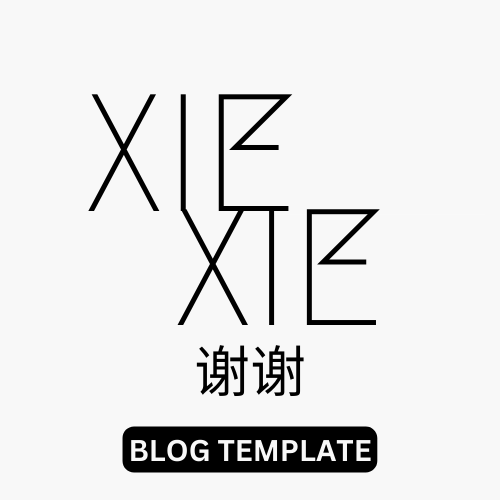

<p align="center"></p>

# `xiexie-blog-template`
Template of a blog for [xiexie 谢谢 static site generator](https://github.com/jmaczan/xiexie)

## About
It is inteded to provide you a structure of static site generator files. You get ready-to-go files structure. A content and a styling is up to you

## Usage
1. [Install xiexie](https://github.com/jmaczan/xiexie#install)

2. Copy the content of `src` folder, clone this repository or fork it and build a blog upon it

3. **To get a compiled website, run:**
    ```
    xiexie --source ./src --target ./dist
    ```

4. Done! Your website is available in `dist` directory. Files in `dist` are ready to be shared with your hosting platform

Feel free to open issues or email me to ask questions

## License
Free for personal use. [Email me](mailto:jedrzejpawel@maczan.pl) for a commercial license.

Font VT323 is created by Peter Hull. The font's license is available [here](https://fonts.google.com/specimen/VT323/about). You don't have to use this font in your blog. To change it, go to `skeleton.css`, remove first line with `@import` and change fourth line `body`'s `font-family` to anything you want to.

© Copyright [Jędrzej Paweł Maczan](https://maczan.pl/). Made in [Poland](https://en.wikipedia.org/wiki/Poland), 2022
